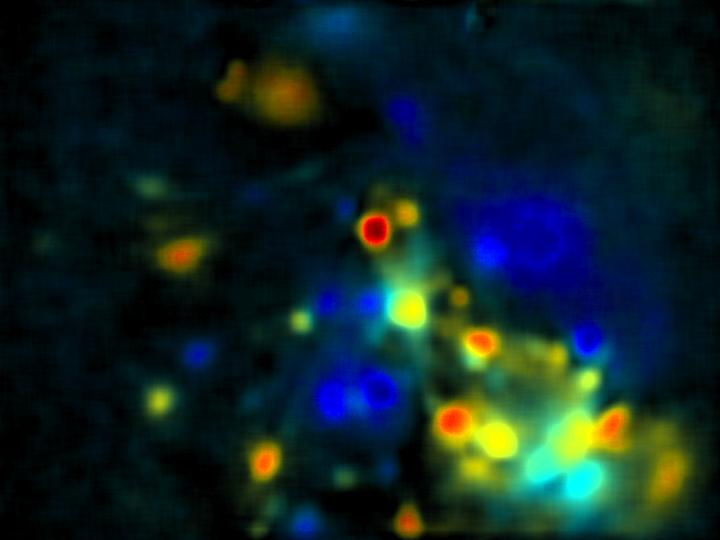

** Under construction **

# Basic Analysis Pipeline for Songbirds

**NOTE: Code described here requires that the FreedomScope repo is also installed.**

This code serves as a specific analysis pipeline for extracting fluorescence time series traces from the .mov files generated from the FreedomScopes, triggered during song.

1. Log each .mov file from each recording session in  a dedicated directory for each session. i.e. store each animal in a separate directory. Have subdirectories for each day of imaging.

2. When you are done for the day/session, open the directory you made in the last step in MATLAB, and run:

```
>> FS_AV_Parse.
```

This will parse the .mov files into matlab-readable .m files, and will created a cell array for video data, and a corresponding cell array with synchronized mic data. The use of this synchronization cell array will be used for aligning to the zebrafinch song.

3. Run:

```
>> FS_Dff('type','BackgroundSubtract')  
```
Alternatively, you can use:
```
>> FS_Dff('type','Dff',0)% will take the 0th percentile as background
```

...which will make a downsampled, background subtracted video as well as a maximum projection image for each file in your directory. In addition, it will make a Average-maximum projection image called Dff_composite, of all the recordings from the session combined.

At this point, The calcium imaging videos exist in the cell video.frames.cdata contained inside each .m file in the mat folder. It is stored as a 4D matrix (H,W,C,T) and can be plugged into any analysis pipeline- although it may need to be formatted differently depending on your application. Next Step is to do template alignments.


```
>> FS_TemplateMatch
```

This will open the .mat directory and ask the user to select a song to use as a template.


eventually, you will cluster the data.


Change Directories to >mat--> extraction--> mov


## MAX/STD PROJECTIONS
you can run FS_Dff.m again ( as in step 3) or, to just make max and std projections,

```
>> FS_DFF_STD_Image;
```

### Allpix projections



### Average video


### Manual ROI extraction


```
>> IMAGE = imread('Dff_composite');
```


Then, create your ROI mask:
```
>> FS_image_roi(IMAGE);
```
This will open up a GUI to select ROIs from the image you picked. just point over an ROI, click on one you want, drag the mouse out so you get the right size, then unclick your mouse. Then DOUBLE CLICK on the ring you made. it should turn yellow. then you can drag/move the ring over to make another selection.  You can add/move as many ROIs as you want. when you are done, just exit out of the GUI. It will save all your ROIS, and number them...and will create a .tif of your selected ROI map called roi_map_image.tiff, which resides in mat--> image_roi


Then, go into the new 'roi_image' directory and load roi_data_image.mat file into MATLAB

```
>> load('roi_data_image.mat')
```

To extract ROIS from your movies, go back into the .mat directory, and run:

```
>> roi_ave= FS_plot_ROI(ROI);
```
This will extract ROIs, using the mask 'ROI', for every .mat file in the folder.

roi_ave will be saved in the directory 'rois' and it will have all of your ROI time series data in it, as well as calculated dF/F traces, and interpolated traces. you can thumb through the .mat file to check out the data structure. to plot it right away:

```
figure(); plot(roi_ave.interp_time{1},(roi_ave.interp_dff{1,1})); % interpolated df/f
```


```
>> figure(); plot(roi_ave.raw_time{1},(roi_ave.raw_dat{1,1})); % raw data
```


```
figure(); plot(roi_ave.analogIO_time{1},roi_ave.analogIO_dat{1}); % Analog sync'd channel
```


==========================================================

## BATCH SCRIPTS

Template alignment across days:
```
>> FS_BatchJob_Pt01
```

Image Registration, MAX/STD projection Across days
```
>> FS_BatchJob_Pt02
```

ROI selection Across days
```
>> FS_BatchJob_Pt03
```
